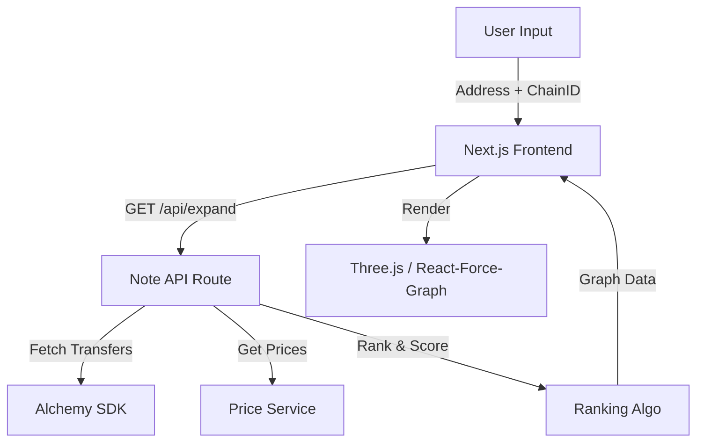

# Chain Explorer - 3D Wallet Relationship Visualizer

Chain Explorer is a high-performance **3D visualization tool** that maps the flow of money between crypto wallets. Inspired by 0xPPL and Arkham Intelligence, it transforms raw blockchain data into an interactive "Space Map" of transactions.


---

## 🏗️ Architecture

The application follows a **Data-Driven Visualization** pipeline:



---

## 🧠 Backend Algorithm (The "Brain")

The core logic resides in `src/app/api/expand/route.ts`. It turns raw transaction logs into meaningful relationships.

### 1. Data Fetching
- **Source**: Alchemy Asset Transfers API.
- **Scope**: Fetches the last **100 historic transfers** (Inbound & Outbound) for the target address.
- **Category**: Filters for `EXTERNAL` (Native ETH/MATIC) and `ERC20` (Tokens) transfers.

### 2. Multi-Chain Support (`lib/alchemy.ts`)
We use a **Dynamic Client Factory** to support multiple networks. The `chainId` from the request routes to the correct Alchemy instance:
- Ethereum (`1`)
- Base (`8453`)
- Arbitrum (`42161`)
- Optimism (`10`)
- Polygon (`137`)

### 3. Valuation & Pricing (`lib/price-service.ts`)
Raw values (Wei) are meanless for ranking. We convert everything to **USD**:
- **ETH/Native**: Real-time price from CoinGecko.
- **Tokens**: Batch-fetched prices for all ERC20s found in the transfers.
- **Fallback**: Stale-while-revalidate caching prevents rate limits.

### 4. Ranking Algorithm (The "Score")
How do we decide which nodes are "important"?
Each neighbor is assigned a `score`:
```typescript
Score = (TotalVolumeUSD * 1.0) + (TransactionCount * 100)
```
- **High Volume**: Heavily weighted.
- **Frequent Interaction**: Boosts score (even if volume is low).
- **Filtering**: Only the **Top 20** neighbors are returned to keep the graph clean.

### 5. Node Categorization
Nodes are typed to control their visual appearance:
- `main`: The central searched wallet (Blue Halo).
- `highValue`: Top 3 neighbors by USD volume (Gold Border).
- `exchange`: Known exchange addresses (Binance/Coinbase logos).
- `sender`/`receiver`: Standard peers.

---

## 🎨 Frontend Visualization (The "Lens")

The frontend (`src/components/ForceGraph3D.tsx`) is a heavily customized WebGL renderer built on `react-force-graph-3d`.

### 1. Radial Star Layout
We don't rely on random physics. We enforce a structured **Radial Layout**:
- **Custom D3 Force**: A custom force runs every tick.
- **Logic**:
  - `Main Node`: Fixed at `(0,0,0)`.
  - `Neighbors`: Pushed outwards but constrained to a flattened Z-plane (`vz *= 0.9`).
  - Result: A clean "Star" or "Galaxy" shape that is easy to read.

### 2. Thick Beam Edges (`CylinderGeometry`)
Standard lines are too thin. We implemented **Volume-Based Beams**:
- **Geometry**: `THREE.CylinderGeometry` aligned to the Z-axis.
- **Scaling**:
  - **Thickness**: Proportional to `log10(USD Value)`.
  - **Length**: Scaled dynamically to match the exact distance between nodes (`linkPositionUpdate`).
- **Color Coding**:
  - 🟢 **Green**: Inbound Money (Others → Main).
  - 🔴 **Red**: Outbound Money (Main → Others).
  - 🟣 **Purple**: Bidirectional.

### 3. Visual Effects (FX)
- **Central Halo**: A pulsing blue ring made of `THREE.RingGeometry` sprites that expand/contract.
- **Deep Space**: Fog (`FogExp2`) and a dark gradient background create depth.
- **Bloom**: `UnrealBloomPass` adds a neon glow to the high-value beams.

---

## 🛠️ Setup & Usage

### 1. Install Dependencies
```bash
npm install
```

### 2. Configure Environment
Create `.env.local`:
```env
NEXT_PUBLIC_ALCHEMY_API_KEY=your_key_here
NEXT_PUBLIC_WALLETCONNECT_PROJECT_ID=your_id_here
MEM0_API_KEY=your_mem0_key_here
```
For the unified financial graph and per-node chat: set `MEM0_API_KEY` (and optionally `MEM0_BASE_URL` for self-hosted). Enable Mem0's graph feature for relationship edges between memories.

### 3. Run Development Server
```bash
npm run dev
```
Open [http://localhost:3000](http://localhost:3000).

---

## � Deployment (Vercel)

When deploying to Vercel, you **MUST** add the environment variables in the project settings, otherwise the API will fail to fetch data.

1. Go to your Vercel Project Dashboard.
2. Navigate to **Settings** > **Environment Variables**.
3. Add the following keys:
   - `NEXT_PUBLIC_ALCHEMY_API_KEY`
   - `NEXT_PUBLIC_WALLETCONNECT_PROJECT_ID`
4. **Redeploy** your application for changes to take effect.

---

## �🔎 How to Use
1. **Connect Wallet**: Toggle networks (Eth/Base/Arb) using the top-right button.
2. **Search**: Enter an address (e.g., `vitalik.eth`).
3. **Explore**:
   - **Click** a node to focus.
   - **Hover** for USD value.
   - **Drag** to rotate the camera.
# graphs
